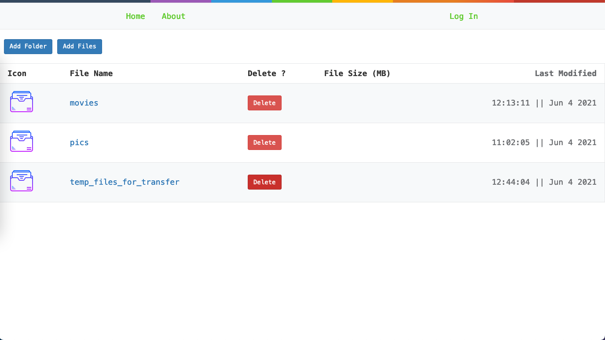
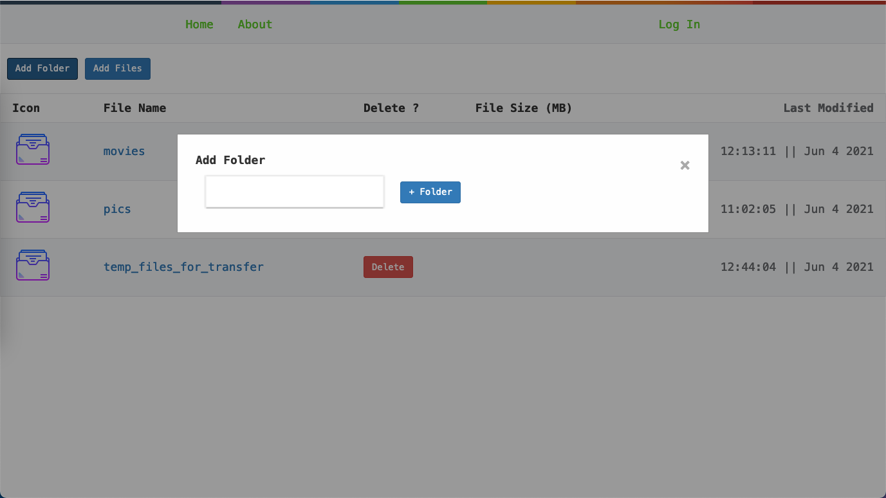
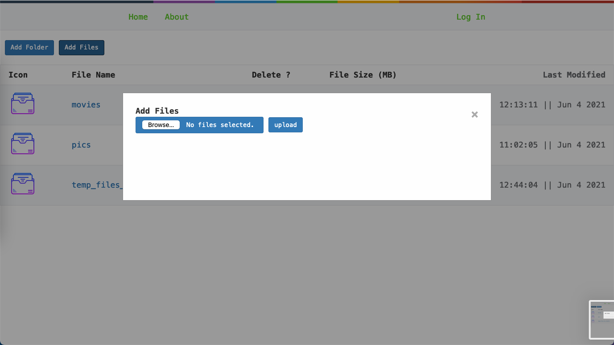
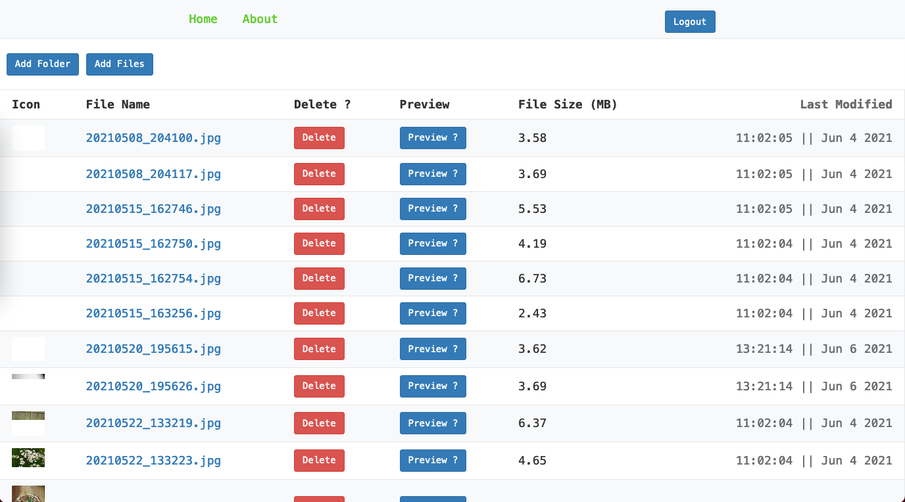
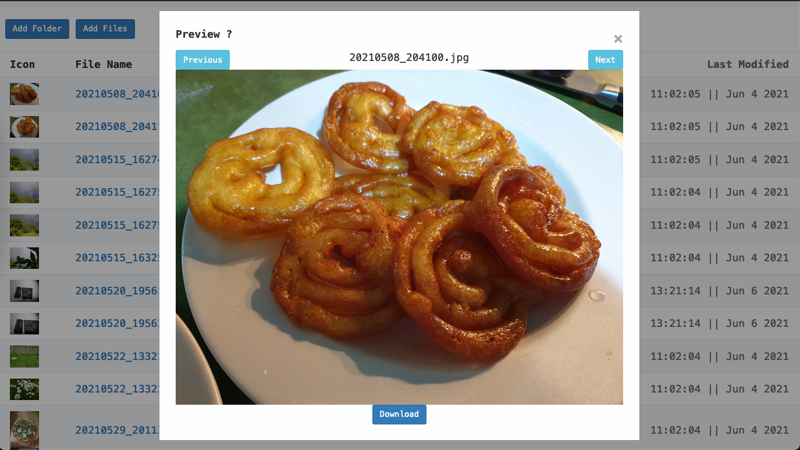

# pi-file-server

It's not necessarily a raspberry pi server. It can run anywhere. The backend is written in Golang. Mainly because I wanted to experiment with Golang and did not want to build a "tutorial" project. So here's me experimenting. The frontend is written in SvelteJS as it has a small footprint.

Here's how you get started. You would obviously need Golang to compile on the Pi. 

These are the command line flags

addr =v"HTTP network address"\
globalPath = "Directory to files"\
secret = "Secret key for the crypto library."\
signUpSecret = "This is the 'admin password' for creating new accounts"

Files can be read without signing up, but POST, DELETE requires authentication. None of the files are encrypted, however I do on user specific directories and password protected zip files. But that's a work-in-progress. So if anyone yoinks the hard drive they have sensitive data. Also you need a SQLITE3 database with the name users in the root and here's you create table command. You could use SQLITE3 browser.

CREATE TABLE users (
    name VARCHAR(255) NOT NULL,
    email VARCHAR(255) NOT NULL,
    hashed_password CHAR(60) NOT NULL,
    created DATETIME DEFAULT (datetime('now','localtime')),
    active BOOLEAN NOT NULL DEFAULT TRUE
);

The files directory contains css and the html for the frontend. The build folder within "files" will have the files uploaded, deleted, accessed etc. 

If you use the globalPath copy the files directory structure with the contents over to your preferred directory. 

generate.go file is added in tls. Heres an example of the command line flags

go run ./tls/generate_cert.go --rsa-bits=2048 --host=your ip domain etc

Here's some pictures of the frontend.

